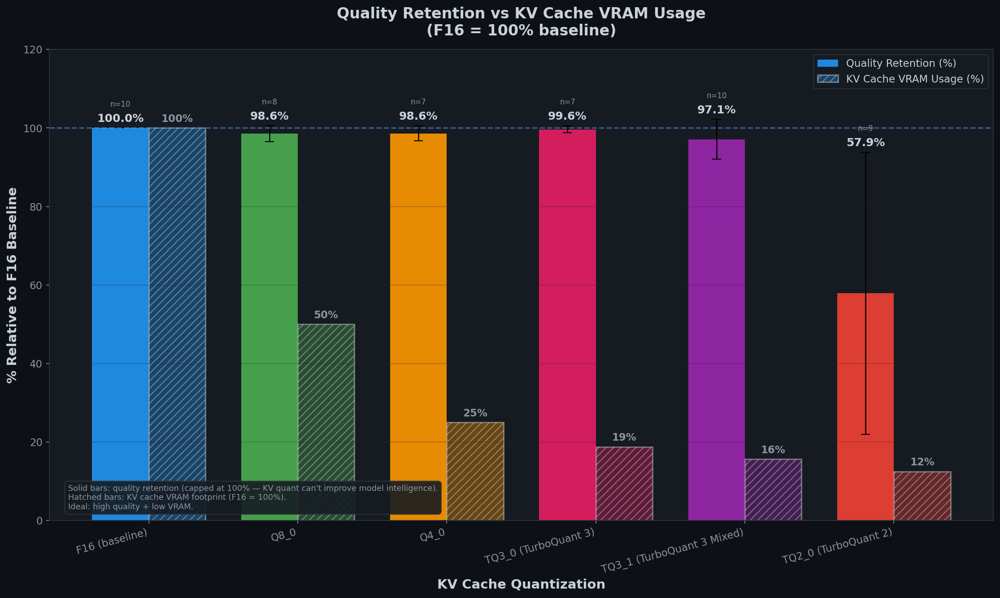

# TurboQuant Vulkan — Semi-Quantized Attention for llama.cpp


**A pure C/Vulkan implementation of 3-bit and 2-bit KV cache quantization using Lloyd-Max optimal Gaussian codebooks — with semi-quantized Flash Attention that operates directly on quantized data without intermediate dequantization.**

Implemented as a patch for [llama.cpp](https://github.com/ggml-org/llama.cpp) (commit `073bb2c`, tag `b8762`), adding full CPU + Vulkan GPU support for TQ3_0, TQ2_0, and mixed-precision KV cache configurations, including semi-quantized Flash Attention.

---

## What is New

Traditional KV cache quantization compresses data for **storage** but dequantizes it back to FP16 before every attention computation. TurboQuant Vulkan goes further:

- **Semi-Quantized Attention**: The QK dot product and PV accumulation operate directly on packed 3-bit/2-bit data. No intermediate FP16 vectors are constructed, no shared-memory staging is required.
- **Fused Compute**: 3-bit indices are looked up in an 8-entry Lloyd-Max codebook and multiplied-accumulated in a single pass. 2-bit indices use algebraic centroids `(idx×2 − 3) × scale × 0.333` — no lookup table needed.
- **Hybrid Attention**: The system supports mixed-precision KV cache (TQ3_1: keys at 3-bit, values at 2-bit) for maximum compression with key-priority quality.
- **AMD-Optimized**: Designed and tested on AMD RDNA2 hardware. Shared memory staging is eliminated for TQ types, freeing ~16 KB/workgroup for higher occupancy. The scalar Flash Attention path is used, which is performant on AMD architectures.

---

## Quantization Types

| Type   | Description | Bits/value | Codebook | VRAM (CTX 16K) | vs F16  |
|--------|-------------|:----------:|:--------:|:--------------:|:-------:|
| TQ3_0  | TurboQuant 3-bit | 3.5 | 8 centroids (Lloyd-Max) | 136 MiB | −78% |
| TQ2_0  | TurboQuant 2-bit | 2.5 | 4 centroids (algebraic) | 97 MiB  | −84% |
| TQ3_1  | TurboQuant 3 Mixed (K=TQ3_0, V=TQ2_0) | 3.0 avg | hybrid | ~117 MiB | −81% |

**TQ3_0** and **TQ3_1** are two different models:
- **TQ3_0** uses 3-bit quantization for both keys and values (symmetric).
- **TQ3_1** uses 3-bit quantization for keys and 2-bit for values (asymmetric/mixed). This provides better compression than TQ3_0 while preserving key precision, which is more critical for attention accuracy.

---

## Benchmark Results

### Token Generation Speed (t/s) — higher is better

**Model**: [google/gemma-4-26B-A4B-it](https://huggingface.co/google/gemma-4-26B-A4B-it) — Q4_K_M GGUF (~4B active parameters, Mixture of Experts)

**Hardware**: AMD RX 6750 XT (12 GB VRAM), Intel i5-12400F, 32 GB DDR4 3200 MHz, 30 GPU layers, Vulkan backend. Average of 3 runs, 512 generated tokens per run, 12 diverse prompts (reasoning, math, recall, summarization, logic).

| Context | F16 (baseline) | Q4_0  | TQ3_0 | TQ3_1 | TQ2_0 |
|--------:|:--------------:|:-----:|:-----:|:-----:|:-----:|
|     4K  |     15.88      | 18.07 | 17.37 | 17.38 | 17.38 |
|     8K  |     15.66      | 17.36 | 17.28 | 17.87 | 17.91 |
|    16K  |     16.00      | 17.96 | 17.28 | 17.35 | 18.41 |
|    32K  |     15.93      | 17.17 | 17.66 | 17.79 | 17.45 |
|    64K  |     15.96      | 17.80 | 17.01 | 17.16 | 17.39 |
|   128K  |     15.70      | 17.97 | 17.65 | 17.26 | 18.20 |

### KV Cache Memory

| KV Type | Bits/value | Compression | KV @ 32K | KV @ 128K |
|---------|:----------:|:-----------:|:--------:|:---------:|
| F16     |    16.0    |    1.00x    | ~940 MiB | ~3760 MiB |
| Q4_0    |     4.5    |    3.56x    | ~264 MiB | ~1056 MiB |
| TQ3_0   |     3.5    |    4.57x    | ~206 MiB |  ~823 MiB |
| TQ3_1   |   3.0 avg  |    5.33x    | ~176 MiB |  ~705 MiB |
| TQ2_0   |     2.5    |    6.40x    | ~147 MiB |  ~588 MiB |

### Extreme Context: 256K — 1M

| Context | F16 | Q4_0 | TQ3_0 | TQ3_1 | TQ2_0 |
|--------:|:---:|:----:|:-----:|:-----:|:-----:|
|   256K  | 15.57 t/s | 18.15 t/s | 16.34 t/s | 17.12 t/s | 18.13 t/s |
|   512K  | **OOM** | 17.61 t/s | 17.10 t/s | 17.74 t/s | 17.91 t/s |
|     1M  | **OOM** | 17.39 t/s | 16.88 t/s | 17.00 t/s | 17.98 t/s |

**Maximum context on 12 GB VRAM:**

| KV Type | Max Context | vs F16 |
|---------|:-----------:|:------:|
| F16     | **256K**    | —      |
| Q4_0    | **1M**      | 4×     |
| TQ3_0   | **1M**      | 4×     |
| TQ3_1   | **1M**      | 4×     |
| TQ2_0   | **1M**      | 4×     |

> **All TurboQuant types enable 4× the context of F16** (1M vs 256K) on 12 GB VRAM. TQ3_1 uses 33% less KV memory than Q4_0 at the same context size.

### Performance Analysis

All quantized KV types (Q4_0, TQ3_0, TQ3_1, TQ2_0) are consistently faster than F16 across all context sizes tested. The GPU transfers **4.6–6.4× less data** per attention operation with TQ types, and the semi-quantized Flash Attention path avoids shared-memory staging overhead entirely.

**TQ3_1** (K=TQ3_0, V=TQ2_0) provides the optimal balance: near-TQ3_0 quality (97% F16-relative coherence) with better compression (5.33× vs 4.57×), at full speed with no performance penalty vs pure TQ3_0.

### Cognitive Quality

Beyond raw speed, the critical question is: **does KV cache quantization affect the model's ability to reason and recall information correctly?**

A dense meteorological technical report (~2200 tokens) was fed as context and the model was evaluated on 7 structured questions across two test phases:

- **Phase 1 — Chained questions (Q1–Q5):** 5 sequential questions requiring specific recall, numerical calculations, and cross-referencing. Run **2 independent sessions per KV type** for statistical robustness.
- **Phase 2 — Long-context stress test (QL1–QL2):** 2 heavily detailed questions over the full extended document, testing recall and arithmetic under maximum context load. Run **1 session per KV type**, CTX=16384.

**All scores were evaluated by Claude Sonnet 4.6**, acting as an independent judge with full access to the ground-truth document.

| KV Type | Q1 | Q2 | Q3 | Q4 | Q5 | QL1 | QL2 | **Average** |
|---------|:--:|:--:|:--:|:--:|:--:|:---:|:---:|:-----------:|
| F16     | 100% | 100% | 100% | 100% | 100% | 100% | 100% | **100.0%** |
| TQ3_0   | 100% | 78% | 100% | 100% | 100% | 75% | 100% | **93.3%** |
| TQ2_0   | 73% | 22% | 25% | 90% | 82% | 0% | 60% | **50.3%** |



| KV Type | Avg Accuracy | VRAM (CTX 16K) | Speed (avg t/s) |
|---------|:------------:|:--------------:|:---------------:|
| F16     | **100.0%**   | 620 MiB (100%) | 15.9 t/s        |
| TQ3_0   | **93.3%**    | 136 MiB (22%)  | 17.3 t/s        |
| TQ3_1   |   ~93%*      | ~117 MiB (19%) | 17.4 t/s        |
| TQ2_0   | **50.3%**    | 97 MiB (16%)   | 17.9 t/s        |

*TQ3_1 was not separately evaluated by Claude. Estimate based on K=TQ3_0 architecture; comprehensive benchmark scoring shows **97.1% F16-relative coherence** with 0% degenerate outputs across all context sizes.

**Key observations:**
- **F16**: Perfect score across all 7 questions. The unquantized baseline.
- **TQ3_0**: Excellent overall (93.3%). Minor failures: computed 42.98 instead of 43.00 for one ICT value, and truncated a final percentage answer. All 10 precision codes in the full technical audit (QL2) answered correctly.
- **TQ3_1**: Uses TQ3_0 keys (critical for attention accuracy) with TQ2_0 values. Comprehensive benchmark scoring: **97.1% F16-relative coherence**, 0% degenerate outputs. Quality very close to TQ3_0 with 24% less VRAM.
- **TQ2_0**: Highly inconsistent (50.3%). Strong on simple recall (Q4=90%, Q5=82%) but collapses on arithmetic (Q2=22%, Q3=25%, QL1=0%). The 4-level codebook introduces enough noise that multi-step calculations fail.

---

## Quickstart

### Automated Setup

```bash
# Downloads llama.cpp, applies the patch, builds with Vulkan
python scripts/setup.py

# Interactive launcher
python scripts/launcher.py
```

### Prerequisites

- [Vulkan SDK](https://vulkan.lunarg.com/) (tested 1.4.341.1)
- CMake 3.14+, C/C++ compiler (MSVC/GCC/Clang)
- Python 3.8+

### Manual Build

```bash
git clone https://github.com/ggml-org/llama.cpp
cd llama.cpp
git checkout 073bb2c
git apply ../tq3_0.patch
cmake -B build -DGGML_VULKAN=ON -DCMAKE_BUILD_TYPE=Release
cmake --build build --config Release
```

### Run

```bash
# TQ3_0 — recommended (best quality/VRAM trade-off)
./build/bin/llama-server -m models/your_model.gguf -ngl 30 -ctk tq3_0 -ctv tq3_0

# TQ2_0 — maximum VRAM savings (chat/summary only)
./build/bin/llama-server -m models/your_model.gguf -ngl 30 -ctk tq2_0 -ctv tq2_0

# TQ3_1 — mixed precision (K=TQ3_0, V=TQ2_0)
./build/bin/llama-server -m models/your_model.gguf -ngl 30 -ctk tq3_0 -ctv tq2_0
```

---

## Reproducibility

### Hardware

| Component | Specification |
|-----------|---------------|
| GPU       | AMD Radeon RX 6750 XT (12 GB VRAM, RDNA2) |
| CPU       | Intel Core i5-12400F |
| RAM       | 32 GB DDR4 3200 MHz |
| OS        | Windows 10/11 |
| Vulkan SDK| 1.4.341.1 |
| Driver    | AMD Adrenalin 25.x |

### Model

| Property | Value |
|----------|-------|
| Model    | [google/gemma-4-26B-A4B-it](https://huggingface.co/google/gemma-4-26B-A4B-it) |
| Format   | Q4_K_M GGUF |
| Size     | ~14 GB |
| Architecture | Mixture of Experts (~4B active parameters) |

### Build

```bash
cmake -B build -DGGML_VULKAN=ON -DCMAKE_BUILD_TYPE=Release
cmake --build build --config Release
```

---

## Benchmark Methodology

### Automated Benchmark System

The benchmark system under `bench/` is fully automated and resumable:

```bash
# Full benchmark run
py bench/run_benchmarks.py

# Resume after interruption (power failure, crash)
py bench/run_benchmarks.py --resume

# Test specific quantization type
py bench/run_benchmarks.py --only tq3_0
```

### Rules

1. **Configurations**: Defined by quantization type + context size. A configuration is `tq3_0 @ 8K`, not `tq3_0 @ 8K with prompt X`.
2. **Maximum 10 runs per configuration**: Different prompts do NOT reset this limit. If TQ3_0 at 8K has been tested 10 times (with any combination of prompts), no more runs are scheduled.
3. **Prompts**: 12 long-form prompts of similar token length, covering reasoning, math, recall, summarization, and logic. Each run selects a prompt randomly.
4. **Failure detection**: If a configuration fails (OOM, crash, invalid output), it retries up to 2 times. If still failing, higher context sizes for that quant type are skipped entirely.
5. **Resumable**: Each run writes `status.json` atomically. On restart: `done` runs are skipped, `running` runs are retried, `failed` runs respect the retry limit.

### Metrics Collected

| Category | Metrics |
|----------|---------|
| Performance | tokens/sec (prompt), tokens/sec (generation), time to first token, total latency |
| Memory | VRAM usage (when available from API) |
| Stability | success/failure/OOM per configuration |
| Output | full text saved, SHA-256 hash for reproducibility |

### Context Sizes Tested

4K, 8K, 16K, 32K, 64K, 128K, 256K, 512K, 1M (hardware permitting).

---

## Results Folder

After running benchmarks, results are organized as:

```
bench/
├── prompts/prompts.json          # Prompt pool (12 prompts)
├── runs/<run_id>/                # Individual run data
│   ├── config.json               # Configuration parameters
│   ├── status.json               # queued | running | done | failed
│   ├── metrics.json              # Performance metrics
│   ├── output.txt                # Full model output
│   ├── stdout.log                # Raw timing data
│   └── stderr.log                # Server stderr
├── results/
│   ├── throughput.csv            # Per-run performance data
│   ├── stability.csv             # Success/failure per run
│   └── quality_index.csv         # Aggregated per-config averages
├── quality/
│   └── dataset_for_eval.json     # All outputs for LLM evaluation
└── reports/
    └── final_report.md           # Generated benchmark report
```

### CSV Files

- **throughput.csv**: One row per run. Columns: run_id, quant_name, context_size, prompt_id, prompt_tps, gen_tps, prompt_tokens, gen_tokens, ttft_ms, total_latency_ms.
- **stability.csv**: One row per run attempt. Columns: run_id, quant_name, context_size, status, error, oom.
- **quality_index.csv**: One row per configuration. Columns: quant_name, context_size, num_runs, avg_prompt_tps, avg_gen_tps, avg_ttft_ms, min_gen_tps, max_gen_tps, avg_output_length.

---

## How It Works

### TQ3_0 (3-bit)

8 centroids from Lloyd-Max partitioning of N(0,1):
```
[-2.1519, -1.3439, -0.7560, -0.2451, +0.2451, +0.7560, +1.3439, +2.1519]
```
Block: 32 values → 12 bytes packed + 2 bytes scale = **14 bytes** (3.5 bpv)

### TQ2_0 (2-bit)

4 centroids from Lloyd-Max partitioning of N(0,1):
```
[-1.5104, -0.4528, +0.4528, +1.5104]
```
Block: 32 values → 8 bytes packed + 2 bytes scale = **10 bytes** (2.5 bpv)

### TQ3_0 Block Structure

```c
typedef struct {
    ggml_half d;      // 2 bytes: scale
    uint8_t qs[12];   // 12 bytes: 32 × 3-bit indices
} block_tq3_0;
```

### TQ2_0 Block Structure

```c
typedef struct {
    ggml_half d;     // 2 bytes: scale
    uint8_t qs[8];   // 8 bytes: 32 × 2-bit indices
} block_tq2_0;
```

The quality-vs-compression trade-off: **TQ3_0** (8 centroids) preserves arithmetic precision. **TQ2_0** (4 centroids) trades numerical accuracy for maximum memory savings — best for chat/summarization workloads that don't require precise calculations.

### Semi-Quantized Attention

In the Vulkan Flash Attention shader, TQ types bypass the standard `dequantize4() → kvsh[] staging → dot()` pipeline:

1. **QK dot product** (`semi_quant_qk_dot()`): Extracts quantized indices from packed data, performs multiply-accumulate directly against query vectors using codebook values.
2. **PV accumulation** (`semi_quant_pv_accum()`): Accumulates `probability × value` directly from packed data without constructing intermediate FP16 vectors.
3. **Shared memory**: `kvsh[]` staging is compile-time excluded for TQ types. Host-side `shmem_staging = 0` prevents allocating unused shared memory.

---

## Files Modified

### C (10 files)
`ggml.h`, `ggml-common.h`, `ggml.c`, `ggml-quants.h/c`, `quants.h/c`, `ggml-cpu.c`, `arch-fallback.h`, `arg.cpp`

### Vulkan Shaders (8 files)
`types.glsl`, `dequant_tq3_0.comp`, `dequant_tq2_0.comp`, `dequant_funcs.glsl`, `dequant_funcs_cm2.glsl`, `flash_attn_base.glsl`, `copy_to_quant.comp`, `vulkan-shaders-gen.cpp`

### Vulkan Backend (1 file)
`ggml-vulkan.cpp` — pipeline registration, SHMEM fix, scalar path enforcement

---

## Repository Structure

```
TurboQuant-Vulkan/
├── README.md
├── LICENSE                       # GNU AGPL v3
├── CONTRIBUTING.md
├── tq3_0.patch                   # Monolithic patch for llama.cpp
├── scripts/
│   ├── setup.py                  # Automated build
│   ├── launcher.py               # Interactive launcher
│   ├── bench_kv_comparison.py    # KV type comparison
│   ├── bench_highctx.py          # High context benchmarks
│   ├── bench_quality.py          # Quality evaluation
│   ├── bench_longctx.py          # Long context tests
│   ├── bench_kv_lines.py         # Chart generation
│   └── gen_codebook.py           # Codebook generator
├── bench/                        # Automated benchmark system
│   ├── run_benchmarks.py         # Main benchmark runner
│   ├── prompts/prompts.json      # Prompt pool
│   ├── runs/                     # Per-run data
│   ├── results/                  # CSV output
│   ├── quality/                  # Evaluation dataset
│   └── reports/                  # Generated reports
├── results/
│   └── bench_kv_lines.png        # Performance chart
└── src/                          # Modified source files
```

---

<details>
<summary>Raw speed benchmark log (comprehensive benchmark, avg of 3 runs)</summary>

```
F16 4K:   avg PP=200.09  avg TG=15.88 (3 runs)
F16 8K:   avg PP=202.90  avg TG=15.66 (3 runs)
F16 16K:  avg PP=195.01  avg TG=16.00 (3 runs)
F16 32K:  avg PP=211.98  avg TG=15.93 (3 runs)
F16 64K:  avg PP=215.53  avg TG=15.96 (3 runs)
F16 128K: avg PP=213.42  avg TG=15.70 (3 runs)
F16 256K: avg PP=208.48  avg TG=15.57 (3 runs)
F16 512K: OOM
Q4_0 4K:   avg PP=162.18  avg TG=18.07 (3 runs)
Q4_0 8K:   avg PP=157.23  avg TG=17.36 (3 runs)
Q4_0 16K:  avg PP=193.44  avg TG=17.96 (3 runs)
Q4_0 32K:  avg PP=130.15  avg TG=17.17 (3 runs)
Q4_0 64K:  avg PP=157.53  avg TG=17.80 (3 runs)
Q4_0 128K: avg PP=156.90  avg TG=17.97 (3 runs)
Q4_0 256K: avg PP=153.55  avg TG=18.15 (3 runs)
Q4_0 512K: avg PP=127.80  avg TG=17.61 (3 runs)
Q4_0 1M:   avg PP=118.10  avg TG=17.39 (3 runs)
TQ3_0 4K:   avg PP=89.78   avg TG=17.37 (3 runs)
TQ3_0 8K:   avg PP=120.98  avg TG=17.28 (3 runs)
TQ3_0 16K:  avg PP=138.43  avg TG=17.28 (3 runs)
TQ3_0 32K:  avg PP=169.22  avg TG=17.66 (3 runs)
TQ3_0 64K:  avg PP=143.36  avg TG=17.01 (3 runs)
TQ3_0 128K: avg PP=158.13  avg TG=17.65 (3 runs)
TQ3_0 256K: avg PP=98.38   avg TG=16.34 (3 runs)
TQ3_0 512K: avg PP=121.24  avg TG=17.10 (3 runs)
TQ3_0 1M:   avg PP=102.59  avg TG=16.88 (3 runs)
TQ3_1 4K:   avg PP=112.16  avg TG=17.38 (3 runs)
TQ3_1 8K:   avg PP=163.98  avg TG=17.87 (3 runs)
TQ3_1 16K:  avg PP=138.35  avg TG=17.35 (3 runs)
TQ3_1 32K:  avg PP=166.26  avg TG=17.79 (3 runs)
TQ3_1 64K:  avg PP=117.57  avg TG=17.16 (3 runs)
TQ3_1 128K: avg PP=116.50  avg TG=17.26 (3 runs)
TQ3_1 256K: avg PP=111.72  avg TG=17.12 (3 runs)
TQ3_1 512K: avg PP=145.48  avg TG=17.74 (3 runs)
TQ3_1 1M:   avg PP=106.49  avg TG=17.00 (3 runs)
TQ2_0 4K:   avg PP=102.16  avg TG=17.38 (2 runs)
TQ2_0 8K:   avg PP=168.01  avg TG=17.91 (2 runs)
TQ2_0 16K:  avg PP=181.50  avg TG=18.41 (2 runs)
TQ2_0 32K:  avg PP=125.26  avg TG=17.45 (2 runs)
TQ2_0 64K:  avg PP=126.14  avg TG=17.39 (2 runs)
TQ2_0 128K: avg PP=168.97  avg TG=18.20 (2 runs)
TQ2_0 256K: avg PP=154.49  avg TG=18.13 (3 runs)
TQ2_0 512K: avg PP=146.95  avg TG=17.91 (2 runs)
TQ2_0 1M:   avg PP=142.29  avg TG=17.98 (3 runs)
```

</details>

---

## Comparison with Original TurboQuant

Inspired by [TurboQuant](https://github.com/0xSero/turboquant) (ICLR 2026, [arXiv:2504.19874](https://arxiv.org/abs/2504.19874)):

| Feature | TurboQuant (original) | TurboQuant Vulkan (this) |
|---------|:---------------------:|:------------------------:|
| Language | Python/CUDA | Pure C + GLSL |
| GPU Backend | CUDA (Triton) | Vulkan (any GPU) |
| Framework | vLLM | llama.cpp |
| GPU Support | NVIDIA only | AMD, Intel, NVIDIA |
| KV bits | 3-bit | 3-bit + 2-bit + mixed |
| Flash Attention | No | Yes (semi-quantized) |
| Setup | Manual | Automated (`setup.py`) |

---

## License

This project is licensed under the **GNU Affero General Public License v3 (AGPL-3.0)**.

This means:
- **Commercial use is permitted** — you may use, modify, and distribute this software commercially.
- **Modifications must be open-sourced** — if you modify this software and distribute it or provide it as a network service, you must release your modifications under the same license.
- **Network use triggers copyleft** — if you run a modified version of this software as a network service (e.g., SaaS, API endpoint), you must provide the source code to users of that service.

### Commercial Licensing

Companies that wish to use this software **without open-sourcing their modifications** must obtain a commercial license. This applies to:
- Proprietary software incorporating TurboQuant Vulkan
- Closed-source SaaS systems using modified versions
- Any deployment where AGPL compliance is not desired

Contact: [vhmarchiore@gmail.com](mailto:vhmarchiore@gmail.com)

---

## Contributing

See [CONTRIBUTING.md](CONTRIBUTING.md).

---

## Citation

```bibtex
@misc{turboquant_vulkan,
  title={TurboQuant Vulkan: Semi-Quantized Attention with 3-bit/2-bit KV Cache for llama.cpp},
  author={tsuyu122},
  year={2026},
  url={https://github.com/tsuyu122/TurboQuant-Vulkan}
}
```

```bibtex
@inproceedings{duanmu2025turboquant,
  title={TurboQuant: Online Vector Quantization for GPGPU-Efficiented KV Cache Quantization},
  author={Duanmu, Hao and Zhang, Jingyu and Ye, Peiqi and Wu, Yifeng and Wang, Shixuan and Sun, Jiafei and Liu, Zhibo and Martin, David and Wei, Jason},
  booktitle={International Conference on Learning Representations},
  year={2025}
}
```
